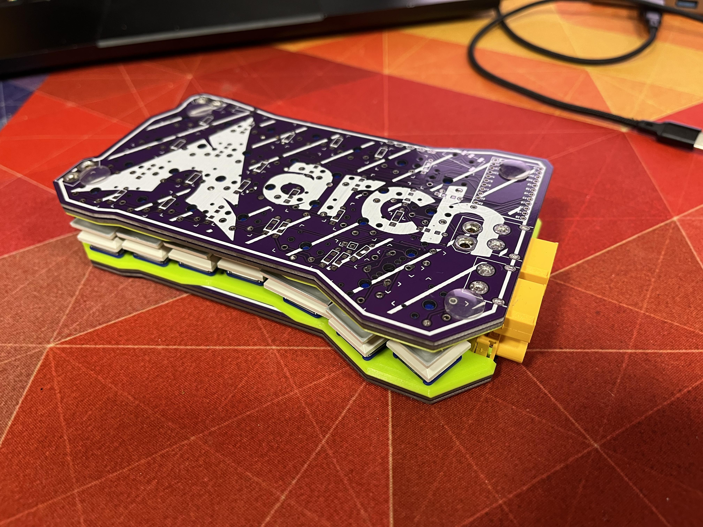
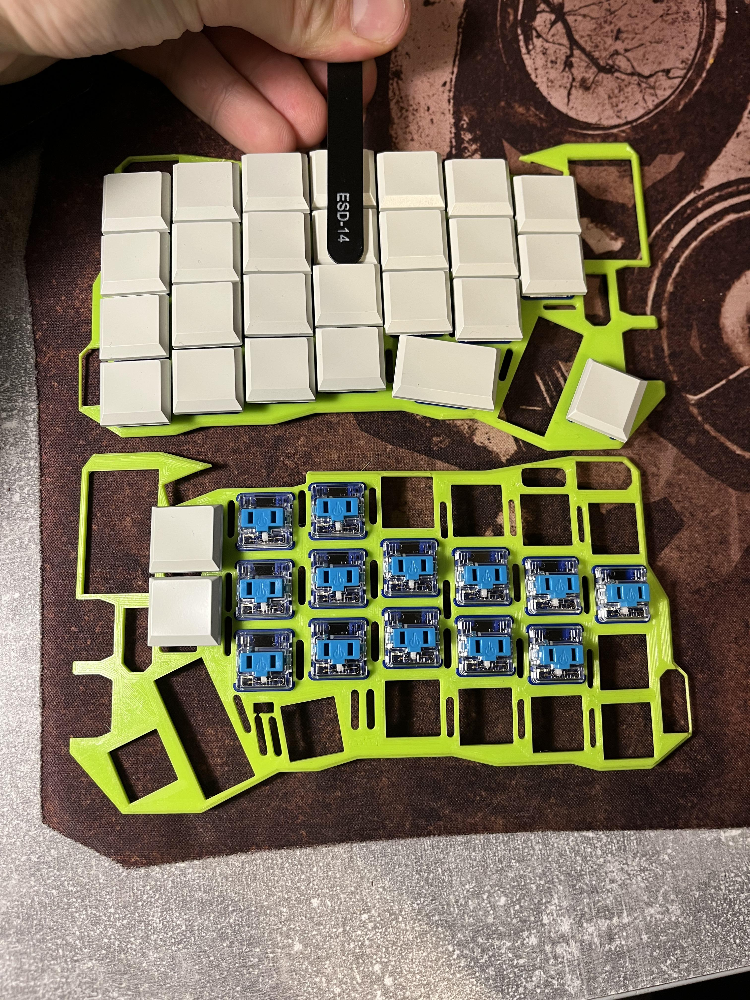
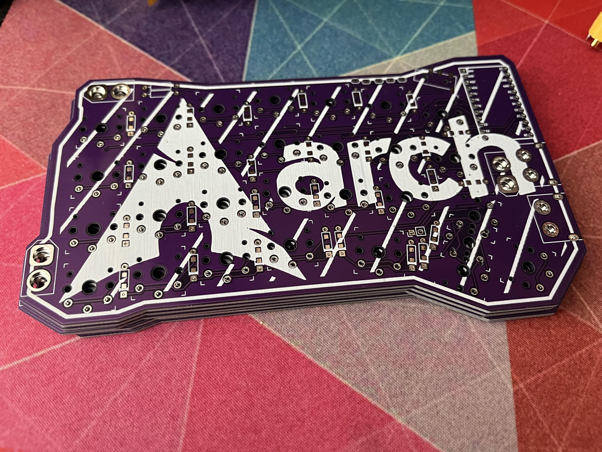
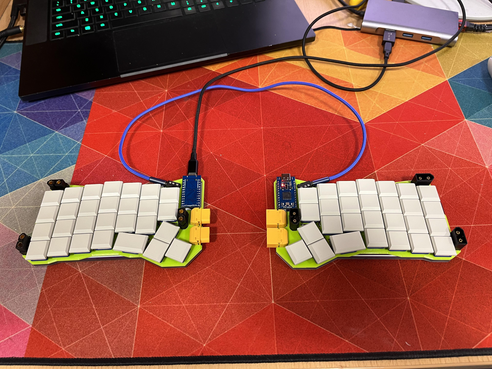
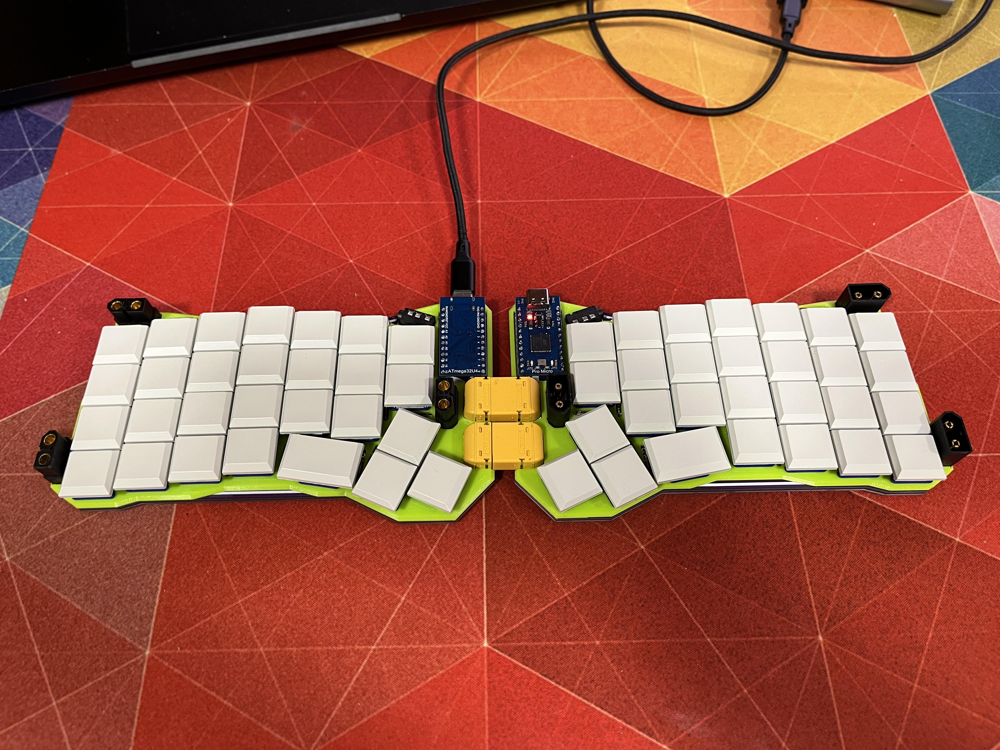
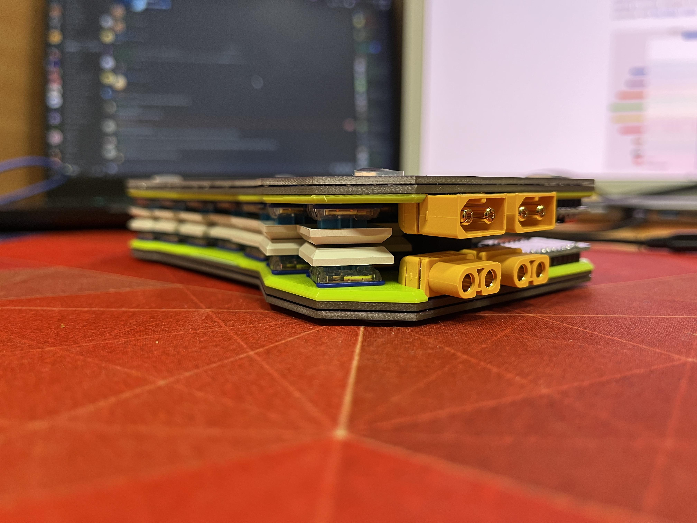
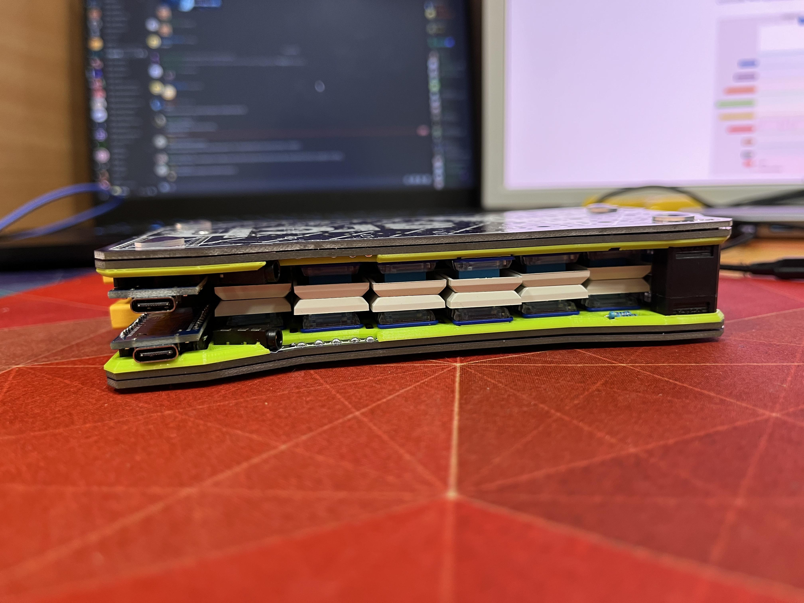
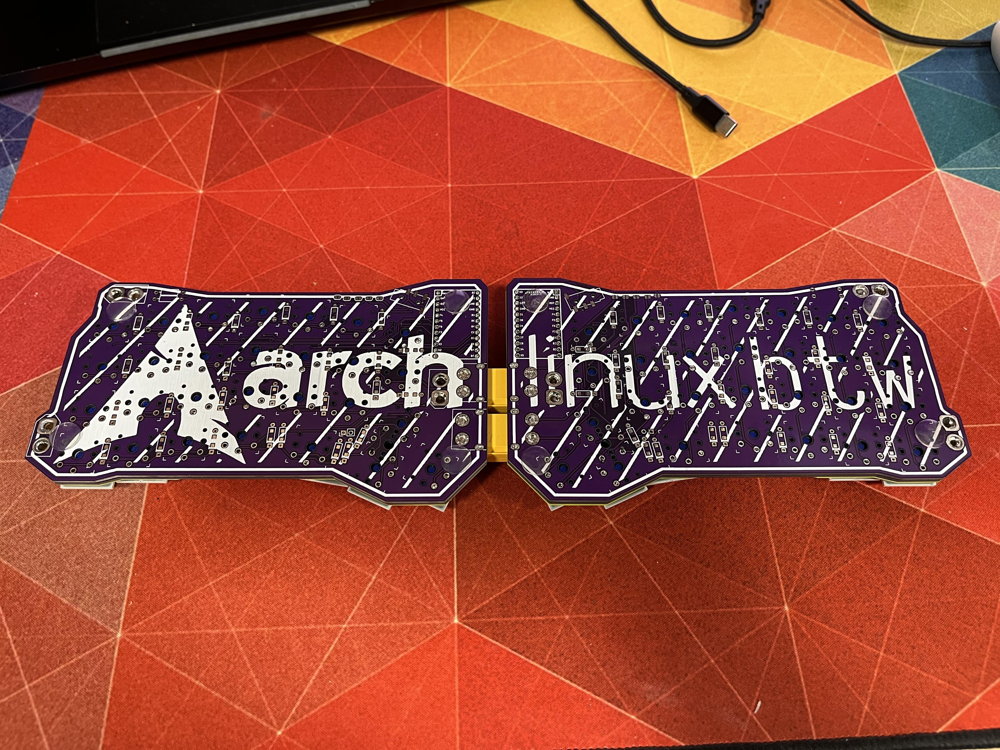
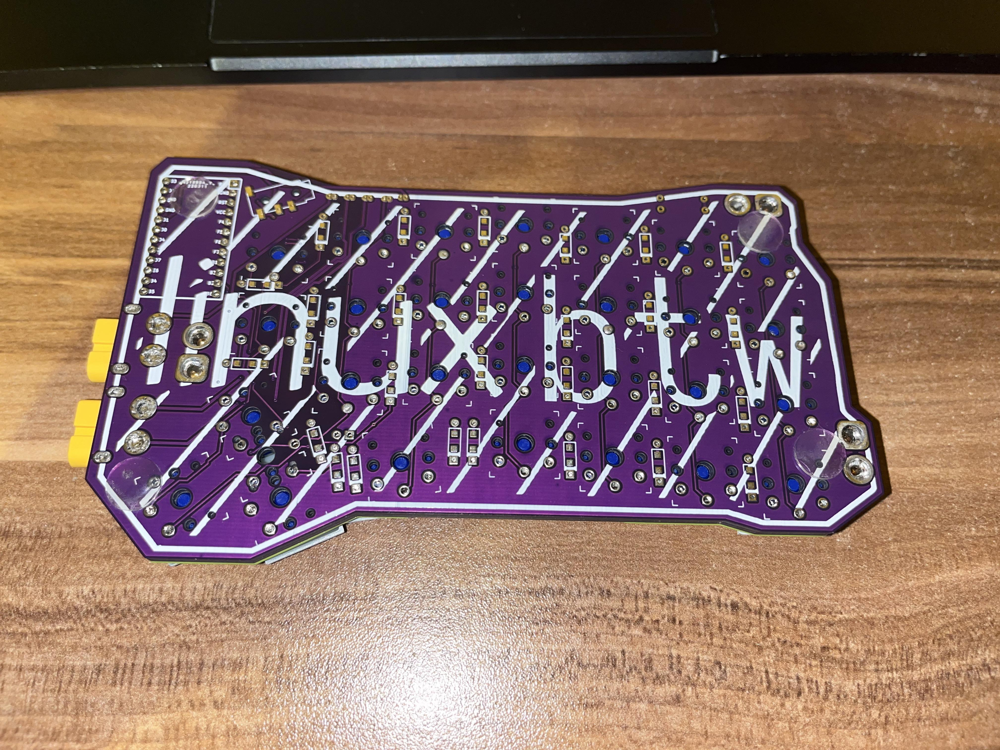

## ErgoTravelXT

Portable, low profile keyboard with extra XT60s.

Based on original ErgoTravel by jpconstantineau [here](https://github.com/jpconstantineau/ErgoTravel)

Changes from the original ErgoTravel.

- Kalih Choc switches only (no MX switches)
- Tighter key grid (only 17.5x16.5mm Kalih keycaps supported)
- Removed LEDs because I was lazy
- One extra key
- **10 XT60 connectors**
- Foldable
- Connectable (if you connect the two halves you don't need TRRS cable)

## Build

**See issues below.**

Build process is pretty similiar to [original ErgoTravel](https://github.com/jpconstantineau/ErgoTravel/blob/master/BuildInstructions.md).

Also please use I2C, it's based.

You will need three pairs of standard XT60s and two pairs of right angle XT60s (XT60PW).
Before soldering them you will probably have to cut those metal contacts in half, without doing that, they won't fit.

The "case" consists of a 3d printed top plate (available in 3Dmodels directory), and an extra PCB, that you solder at the end **after testing everything**. Disassembly can be really difficult, you don't want to deal with that.
As the minimal order quantity from JLCPCB is 5pcs it's enough for two actual PCBs and two bottom plates, with one pcb extra.
When it comes to soldering the bottom plates, I soldered them in the place where XT60s are and in the middle of the board for extra rigidity.

## Issues

3D printed case I used turned out to be a bit too tight and the keyboard ended up being a bit banana-like, due to insufficient tolerances. In the file in this repo I added extra spacing, so it **should** be fine, but if you see that the top plate with switches inserted in it bends, add more spacing and re-print.

Using a PCB as a keyboard case/bottom plate is risky because you can create a short by placing it on something conductive. You should add some rubber feet and preferably add a conformal coating to the board (and desoldering it will be a pain.)

Also no Arch Linux logo in the included files, I don't want to deal with copyright

## Code

Code folder includes modified ErgoTravel qmk firmware. It supports the extra key, thats on the ErgoTravelXT.

## Photos

